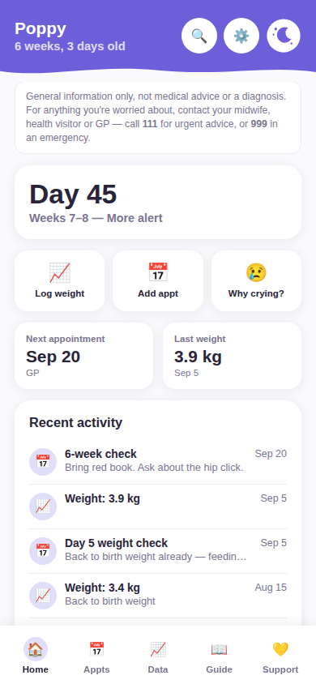
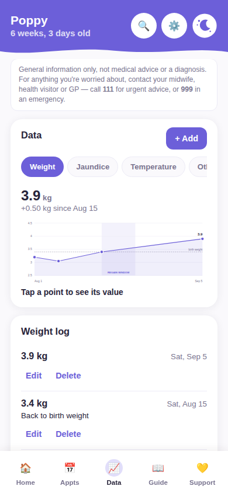
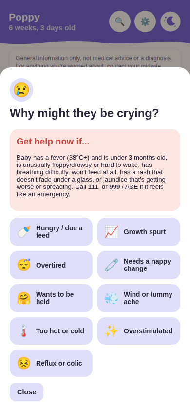
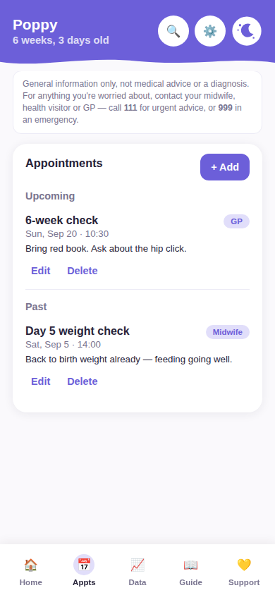
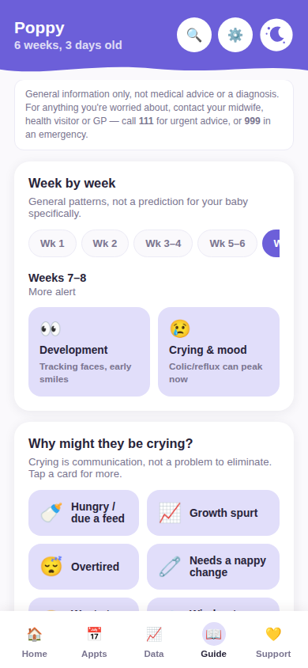
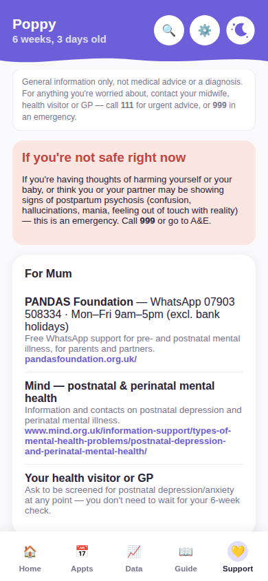
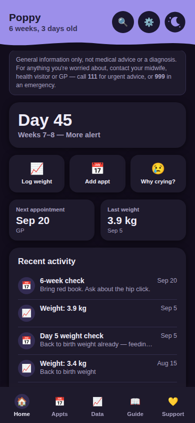

<div align="center">

# Newborn Companion

**Keep track of appointments, what was actually said, and how your baby is doing — through the first twelve weeks.**

One HTML file. No build step, no server, no account, no data leaving your device.

  

</div>

---

> ### ⚠️ Not medical advice
>
> This is **general information only** — not medical advice, not a diagnosis, and **not affiliated with the NHS** or any healthcare provider.
>
> If you are worried about your baby or yourself, contact your midwife, health visitor or GP. In the UK call **111** for urgent advice, or **999** in an emergency.
>
> Guidance here is UK-oriented and reflects general NHS public information about typical newborn patterns. Your clinical team knows your baby; this app doesn't. Always defer to them.

---

## Why this exists

The first few weeks with a newborn involve a surprising amount of admin, arriving at exactly the moment you are least able to do admin. Midwife visits, health visitor visits, weigh-ins, jaundice checks, the heel prick, the six-week check. Someone tells you something important while you're running on three hours' sleep, and by the time you get home it's gone.

Meanwhile the questions that actually keep you up are the ones no leaflet answers well: *Is this amount of crying normal? Should she be back to her birth weight by now? Is this jaundice getting better or worse?*

Built for my own family during paternity leave. Published in case it's useful to someone else in the same fog.

## What it does

### 📅 Appointments — with what was said

Log midwife, health visitor, hospital and GP visits. The important bit is the notes field: what they actually told you, what to watch for, what happens next. The thing you always forget.

### 📈 Data — measurements over time

Track weight, jaundice (bilirubin) levels, temperature, or anything else. The weight chart plots birth weight as a reference line and shades the window where most babies are back to it, so a normal early dip looks like what it is rather than something to panic about.

### 📖 Guide — week by week

What tends to happen in weeks 1–12: feeding patterns, sleep, which checks fall due, what "normal" usually looks like. Follows your baby's current age automatically.

### 😢 Crying — the 3am question

The common reasons a newborn cries, roughly most to least likely, each with a bit of context. Alongside the red flags that mean *stop reading this and call 111*.

### 💛 Support — for both parents

Signposting to real services, with separate sections for mum and dad. Postnatal depression in fathers is under-recognised and under-diagnosed, so it gets its own section rather than a footnote.

### 🔍 Search

Everything you've logged, searchable: `jaundice`, `midwife`, a date, a name.

<div align="center">

   

<sub>Appointments · Week-by-week guide · Support · Automatic dark mode</sub>

</div>

### Born early?

Enter gestational age at birth and the app shows **adjusted age** alongside actual age, and follows adjusted age for the week-by-week guide — since that tracks development more usefully for premature babies. Appointment timing still follows your neonatal team's schedule, not this.

## Privacy

**Everything stays on your device.** All data lives in your browser's `localStorage`. No server, no account, no analytics, no network requests of any kind. Nothing is transmitted anywhere, because there is nowhere for it to go.

The trade-off is real: clearing your browser data or switching phones **loses everything**. Use **Settings → Export backup** regularly. Those exported files contain real health data, so keep them somewhere private — they're git-ignored here for that reason.

## Running it

No build step. No dependencies. No server.

```bash
git clone https://github.com/reubenisabuilder/Newborn-companion.git
cd Newborn-companion
open index.html
```

Or just download `index.html` and open it in any modern browser.

On a phone, use **Add to Home Screen** for an app-like icon and full-screen launch.

## Design notes

- **One file, vanilla JS, no framework.** It should still open and work in ten years, which matters more here than developer ergonomics.
- **Mobile-first, one-handed, 3am.** Warm palette, large touch targets, automatic light/dark.
- **Charts are hand-rolled SVG.** No charting library for six data points.
- **Accessibility:** labelled fields, keyboard-dismissable dialogs, 44px touch targets, WCAG AA text contrast. Some decorative pastel badges still fall short of AA and are on the list.

## Status

Working and in daily use, but deliberately minimal. Known limitations:

- **No sync** — two parents on two phones means two separate sets of data
- **No cloud backup** — manual JSON export is the only safety net
- Content covers weeks 1–12 only

The hosted version is now underway in [`web/`](web/) — Next.js + Supabase, family-code sharing (parents, grandparents, anyone with the code, not capped at two), multiple babies per family, and the same feature set as this file. See [`web/README.md`](web/README.md) for setup and current status. This file stays as the local-only, no-account version.

## Contributing

This is a personal project, so I may be slow. Corrections to the health guidance are especially welcome — **please include a source**. Every factual claim in here should be checkable against NHS or equivalent public guidance, and I'd rather be corrected than confidently wrong in an app people use at 3am.

## Licence

MIT — see [LICENSE](LICENSE). No warranty of any kind; see the disclaimer above.
