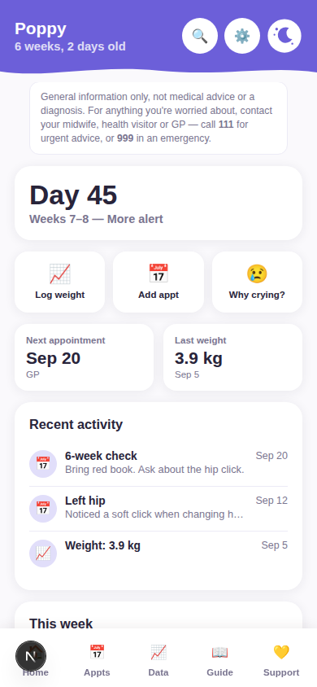
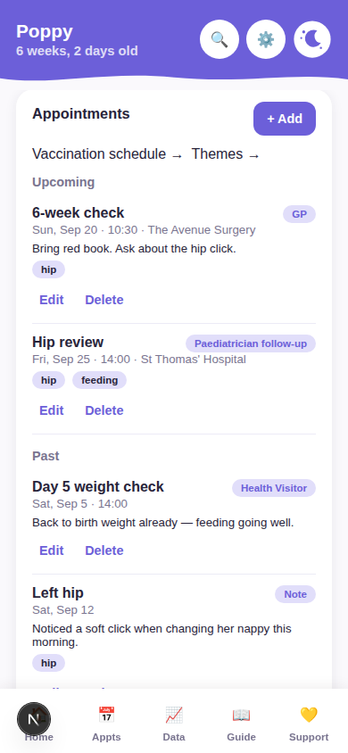
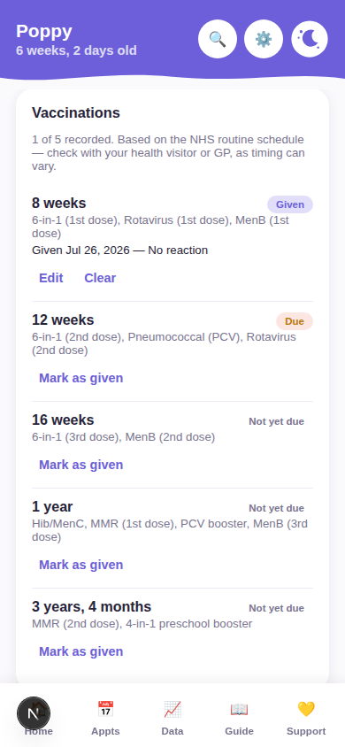
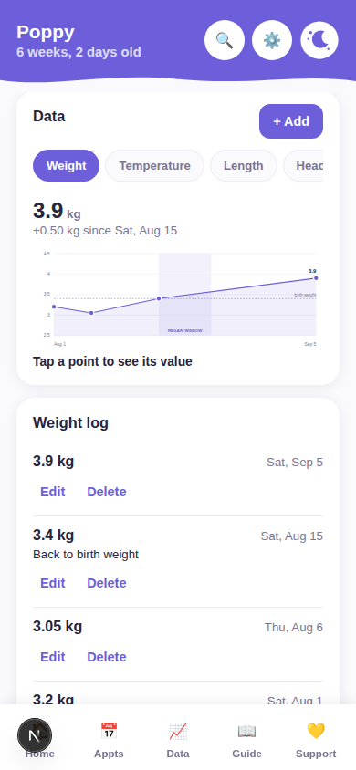
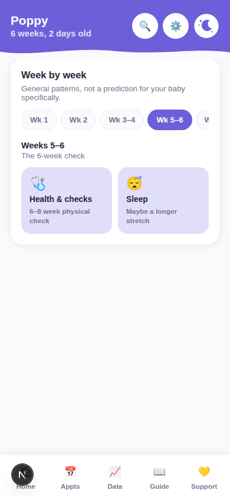
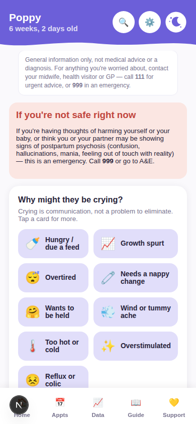
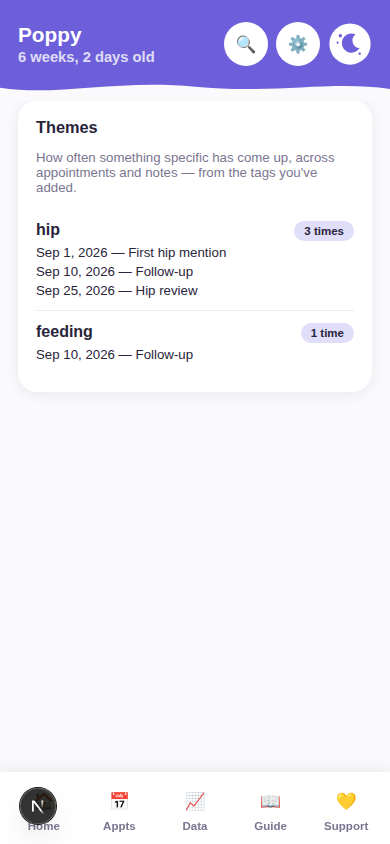

# Newborn Companion — hosted version (Phase A)

The hosted rewrite described in the root repo's plan: Next.js + Supabase,
family-code sharing (parents, grandparents, anyone with the code — no
per-person accounts yet), multiple babies per family, appointments,
vaccination tracking, growth charts, the week-by-week guide, a support tab
(crying reasons, FAQs, and mental-health resources), theme tracking across
appointments/notes, and global search. The original single-file
`index.html` at the repo root is unaffected and still works standalone.

## Screenshots

| | |
|---|---|
|  |  |
| Home | Appointments — free-text type/location, tags |
|  |  |
| Vaccinations — NHS schedule checklist | Data — growth chart |
|  |  |
| Guide — week by week | Support — crying reasons, FAQs, resources |
|  | |
| Themes — how often something's come up | |

Rendered from the real components with fixture data (see
`app/zzpreview/` in git history if you want to regenerate these — that
directory is deleted before every commit, it's a screenshot harness, not
part of the app).

## What's built vs. what needs you

Everything in this directory has been written, typechecked, linted, and
production-built successfully. The schema and RPCs in
`supabase/migrations/0001_init.sql` have been **run against a real
Postgres instance** (with a stub of Supabase's `auth` schema, and — for the
grants specifically — deliberately *without* assuming any default table
privileges, so the migration's own explicit `GRANT`s are what's actually
under test) and verified: family data isolation on reads, direct-ID
lookups and writes; a composite foreign key that stops a baby from ever
being attached to the wrong family (caught as a real bug during review);
`created_by` correctly forced to the real caller and immutable after the
fact, even when a request tries to spoof or rewrite it; the join/create/
delete RPCs, wrong-code handling, and rate limiting (including a race-
condition fix — concurrent guesses are now serialized per requester via an
advisory lock). See the migration file's comments for what each piece is
for.

What hasn't been tested, because it requires infrastructure this
environment doesn't have: an actual Supabase **project** (auth, RLS as
enforced by real PostgREST, Edge Functions, hosting). You'll need to do the
following before this runs for real:

### 1. Create a Supabase project

At [supabase.com](https://supabase.com), create a new project. Grab these
from **Project Settings → API**:

- Project URL → `NEXT_PUBLIC_SUPABASE_URL`
- `anon` / `publishable` key → `NEXT_PUBLIC_SUPABASE_ANON_KEY`

Copy `.env.example` to `.env.local` and fill both in.

### 2. Enable anonymous sign-ins

**Authentication → Sign In / Providers → Anonymous Sign-Ins** — this is off
by default on new projects and the family-code flow depends on it.

### 3. Run the migrations

Via the Supabase CLI (`npx supabase login`, `npx supabase link --project-ref
<ref>`, then `npx supabase db push`), or paste each file in
`supabase/migrations/` into the SQL Editor in the Supabase dashboard and run
them in order (`0001_init.sql`, then `0002_location_and_vaccinations.sql`,
then `0003_appointment_tags.sql`) — each one in full, in one go.

None of these scripts are written to be safely re-run — if one fails
partway through (or you accidentally paste it twice), don't just paste it
again. Run this cleanup first, then paste all three migrations again from
the top, in order:

```sql
drop table if exists vaccinations cascade;
drop table if exists health_logs cascade;
drop table if exists appointments cascade;
drop table if exists babies cascade;
drop table if exists code_attempts cascade;
drop table if exists family_members cascade;
drop table if exists families cascade;
drop schema if exists private cascade;

drop function if exists delete_my_family(uuid);
drop function if exists join_family_by_code(text);
drop function if exists create_family();
drop function if exists protect_created_by();
drop function if exists sync_health_log_numeric();
drop function if exists set_updated_at();
```

**Important:** don't add `private` to Supabase's exposed-schemas list
(Project Settings → API → Exposed schemas). Two internal helper functions
live there specifically so they're *not* reachable as `/rest/v1/rpc/...`
endpoints — only the three intentional public RPCs (`create_family`,
`join_family_by_code`, `delete_my_family`) should be callable from the
client.

### 4. Install and run

```bash
npm install
npm run dev
```

Visit `/join`, create a family, save the code it shows you (it's shown
exactly once), and go from there.

### 5. Deploy

Vercel is the natural fit for a Next.js app. On the "Import Git Repository"
/ "Configure Project" screen:

- **Root Directory**: click "Edit" and set it to `web`. The app lives in
  that subfolder, not the repo root — skip this and the build fails or
  builds the wrong thing.
- **Branch**: until this branch is merged to `main`, tell Vercel to deploy
  `claude/app-creation-btj9p8` specifically (either during import, or
  afterwards in Settings → Git → Production Branch) — `main` doesn't have
  the `web/` app on it yet.
- **Environment Variables**: add `NEXT_PUBLIC_SUPABASE_URL` and
  `NEXT_PUBLIC_SUPABASE_ANON_KEY` on this same screen.
- **Wrong GitHub account/repo showing up?** Vercel only shows repos the
  GitHub App has been granted access to for whichever account/org you're
  currently signed into. Check the account switcher (top-left in the
  Vercel dashboard) is on the right one, and use "Adjust GitHub App
  Permissions" on the import screen to grant access to this specific repo
  under your personal GitHub account if it's not showing up.
- **Landed on a page that mentions Vercel and asks you to log in, instead
  of the app?** That's Vercel's own "Deployment Protection" — team/
  workspace accounts often have this on by default for every deployment,
  requiring a Vercel login before anyone (including family) can view it.
  Turn it off (or restrict it to preview deployments only) in Project
  Settings → Deployment Protection, if you want this reachable by people
  who don't have a Vercel account.

## Schema updated since you last ran it

If you already ran `0001_init.sql` before `0002` and `0003` existed: the
`health_logs` metric types changed (`jaundice`/`other` →
`height`/`head_circumference`), `appointments` gained a `Note` type, a free
text `location` column, and a `tags` array column, and a whole new
`vaccinations` table was added. Re-run the cleanup + all three migrations
from "Run the migrations" above to pick this up — same drill as last time,
and there's still nothing real to lose while this is in testing.

## Design notes from reconsidering the first pass

- **Colour palette is "Lilac"**, landed on after A/B-testing four
  directions in a live comparison artifact: one hue only (light = lilac,
  dark = the same hue deepened), so category badges are told apart by
  their icon rather than five different tint colours, with only true
  semantic colours (good/warn/danger) staying outside that rule. The
  header is a bold solid-colour band with a wavy lower edge, so the
  accent reads as a real shape on the page rather than only tinting
  small badges. Applied to both this app and the original `index.html`.
- **Data tab tracks weight, temperature, length, head circumference —
  not jaundice.** Jaundice (and anything else that's only ever a clinical
  reading) isn't something a parent measures at home and watches trend —
  it's a finding from a visit. That belongs as context to recall, not a
  metric to chart, which is what the next point is for.
- **Appointments now has a "Note" type** for exactly that: something
  noticed between visits (a hip click, something about her feet) with no
  scheduled appointment attached. Same table, same list, same search as
  every other appointment — just no time field, and a lighter prompt on
  the title/notes fields. Deliberately *not* a separate tab or a new
  "topics" concept — appointment notes were already fully searchable, so
  the only genuine gap was somewhere to put an observation with nothing
  scheduled around it.
- **Appointment `type` and `location` are free text with autocomplete**
  from your own family's past entries, not a fixed dropdown. Real-world
  appointment types (GP, health visitor, paediatrician, audiology...) are
  too open-ended for an enum that would only ever grow; chip colour comes
  from loose keyword matching into a small set of buckets instead of an
  exact-string lookup.
- **Vaccinations get their own checklist** (`/vaccinations`, linked from
  Appointments) against the NHS routine schedule — 8/12/16 weeks, 1 year,
  3y4m — rather than being another appointment type. It's sparse by
  design: a row only exists once something's actually recorded, so
  "not yet given" needs no seeding.
- **Theme tracking via tags**: an appointment or note can carry optional
  comma-separated tags ("hip", "feeding"), and `/themes` (linked from
  Appointments) shows exact counts and every matching entry per tag, most-
  mentioned first. Went with explicit tags over scanning notes for
  repeated keywords — precise, no false positives from generic words.
- **Guide and Support were overlapping** — "why might they be crying"
  lived under Guide (development facts) when it's really a confidence
  question ("is this normal, am I doing something wrong"), the same job
  Support already does for parents' own wellbeing. Moved the crying-
  reasons grid and red-flag modal into Support, added a short FAQ
  accordion there too, and left Guide as purely the week-by-week content.
- **The medical disclaimer only shows on Home and Support** now, not on
  every tab — it was noise on Appointments/Data where nothing advice-like
  is happening.
- **Onboarding is now one step shorter**: after creating a family and
  saving the code, you're asked for the baby's name and DOB right there
  (with a "Skip for now" escape hatch) instead of landing on an empty
  dashboard that points you at Settings. The family code also has a copy
  button now instead of manual text selection.
- Importing an old single-file app's backup now converts any legacy
  `jaundice`/`other` entries into Notes instead of dropping them, since
  the new schema no longer has anywhere else to put them.

## Known gaps (by design, for this phase)

- **Guide content** only has full weeks 1–12 plus two representative later
  months seeded, to prove out the new source-attributed, month-keyed shape
  (with NHS Start4Life, The Lullaby Trust, and UNICEF UK Baby Friendly
  Initiative as sources). Filling in the rest of the first year is a
  follow-up content-authoring pass, not a code change.
- **Experience log** (feeding/tummy time/nappies/sleep qualitative logging)
  and the **insight engine** (pattern callouts cross-referenced against
  growth-spurt/teething timing) are Phase B and C — not built yet.
- **Import** of an old single-file app's JSON export only happens once, at
  family creation (`/join`). Re-importing into an existing family, or
  merging two exports, is explicitly out of scope for v1.
- No family-code recovery if every device signs out and the code is lost
  (by design — the code is hashed, never stored in recoverable form). Any
  device that stays signed in can still see the code from Settings-side
  RPCs if that's added later; today there's no "view code again" surface
  either — worth adding before this goes further, since a lost code today
  means genuinely stuck.
